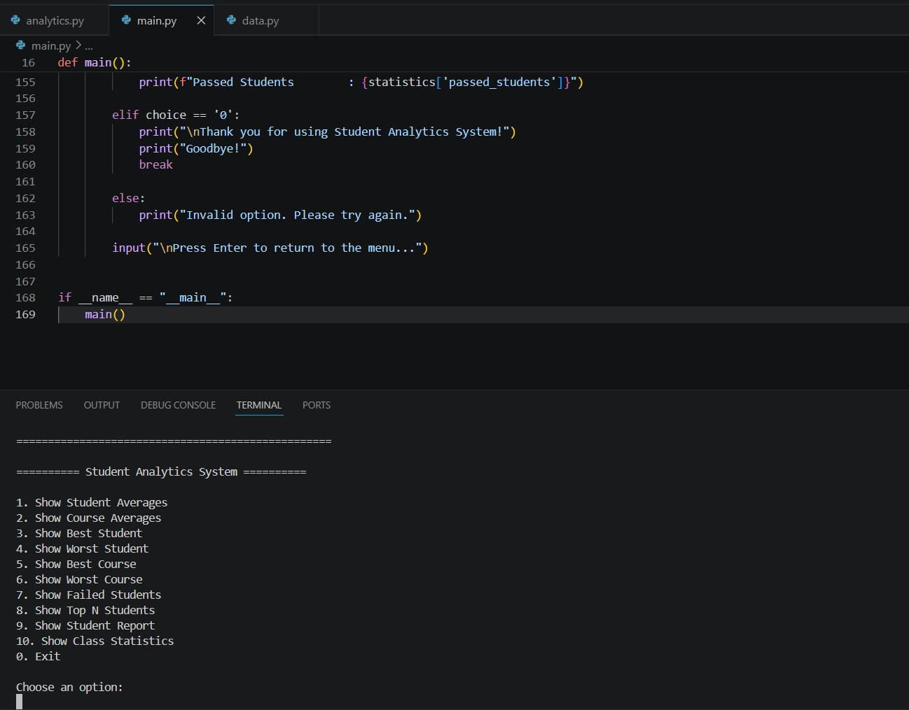
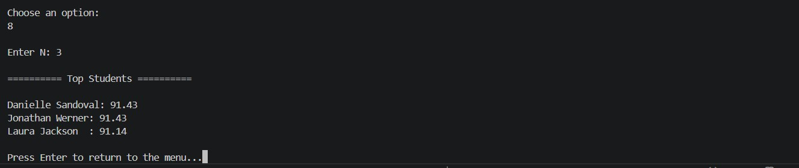
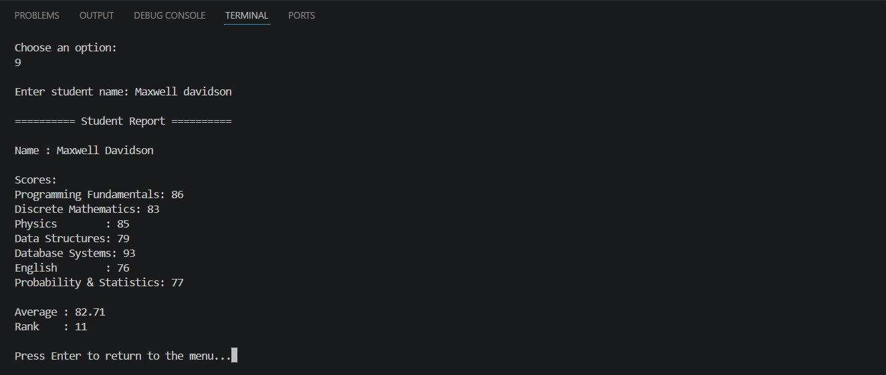
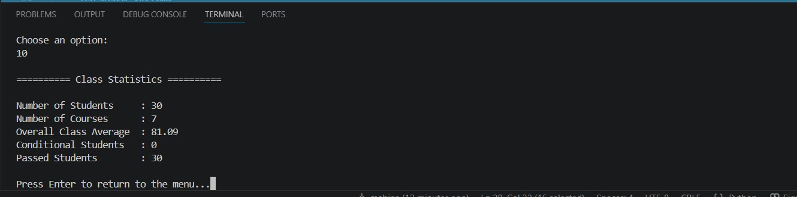

# Student Analytics System

A Python-based Student Analytics System developed using **NumPy** to analyze students' academic performance.

This project provides an interactive command-line interface (CLI) that allows users to calculate student and course statistics, identify top-performing students, generate individual reports, and analyze overall class performance.

---

##  Features

- 📊 Calculate average score for each student
- 📚 Calculate average score for each course
- 🏆 Find the best student
- 📉 Find the weakest student
- ⭐ Find the best course
- 📖 Find the most challenging course
- ❌ Display failed students
- 🥇 Show Top N students
- 👤 Generate a detailed report for any student
- 📈 Display overall class statistics
- ⚠️ Basic error handling for invalid user inputs
- 💻 Interactive command-line menu

---

##  Technologies Used

- Python 3
- NumPy

---

##  Project Structure

```text
student-analytics-system/
│
├── analytics.py
├── data.py
├── main.py
├── README.md
│
└── images/
      main-menu.png
      student-report.png
      top-students.png
      class-statistics.png
```

---

##  How to Run

1. Clone the repository

```bash
git clone https://github.com/mobinsh31/student-analytics-system.git
```

2. Move into the project directory

```bash
cd student-analytics-system
```

3. Run the program

```bash
python main.py
```

---

##  Example Menu

```text
========== Student Analytics System ==========

1. Show Student Averages
2. Show Course Averages
3. Show Best Student
4. Show Worst Student
5. Show Best Course
6. Show Worst Course
7. Show Failed Students
8. Show Top N Students
9. Show Student Report
10. Show Class Statistics
0. Exit
```

---

## 📄 Example Student Report

```text
========== Student Report ==========

Name : Paul Casey

Scores:
-----------------------------------
Programming Fundamentals : 73
Discrete Mathematics     : 81
Physics                  : 93
Data Structures          : 97
Database Systems         : 63
English                  : 80
Probability & Statistics : 87

Average : 82.00
Rank    : 5
```

---
## 📷 Screenshots

### Main Menu



---

### Top Students



---

### Student Report



---

### Class Statistics



##  Future Improvements

- Load datasets directly from CSV files using Pandas
- Add data visualization with Matplotlib
- Export reports to CSV or Excel
- Develop a desktop GUI using Tkinter or PyQt
- Develop a web version using Flask

---

##  Author

**Mobina Shokouhi**

Computer Science Student at Iran University of Science and Technology

Python • NumPy • Machine Learning
